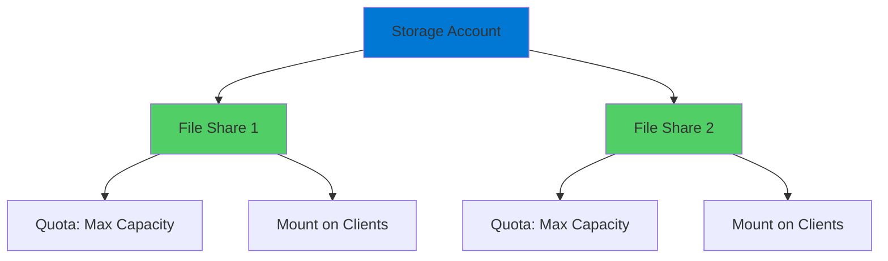

# Azure Files Storage

Managed File Shares in the Cloud

  <carbon-folder-shared class="text-8xl text-blue-400 opacity-80" />

---
layout: center
---

# Welcome

<v-click>

Explore Azure Files Cloud-based file shares with SMB protocol

</v-click>

---
layout: section
---

# What is Azure Files?

---

# Managed File Share Service

<v-click>

  <carbon-folder-shared class="text-6xl text-green-400" />

</v-click>

<v-click>

Fully managed file share service in the cloud

</v-click>

<v-click>

Shared storage that can be mounted into filesystem

</v-click>

<v-click>

Like corporate network file share, but in Azure

</v-click>

---

# Key Benefits

<v-click>

  

    <carbon-scale class="text-6xl text-blue-400" />
    
Scalability

  

  

    <carbon-renew class="text-6xl text-green-400" />
    
Redundancy

  

  

    <carbon-earth class="text-6xl text-purple-400" />
    
Global Availability

  

</v-click>

---
layout: section
---

# Key Features

---

# Four Main Features

<v-click>

  
1

  

    <carbon-network-3 class="text-3xl inline-block" />
    Standard SMB Protocol
    
Server Message Block - same as Windows file shares

    
No special code changes needed

  

</v-click>

<v-click>

  
2

  

    <carbon-checkmark-outline class="text-3xl inline-block" />
    Highly Available and Durable
    
Data replicated to protect against failures

  

</v-click>

<v-click>

  
3

  

    <carbon-cloud-services class="text-3xl inline-block" />
    Fully Managed
    
No file servers, patches, or hardware to maintain

  

</v-click>

<v-click>

  
4

  

    <carbon-hybrid-networking class="text-3xl inline-block" />
    Seamless Integration
    
Works with cloud and on-premises environments

    
Windows, Linux, and macOS

  

</v-click>

---
layout: section
---

# Common Use Cases

---

# Real-World Scenarios

<v-click>

  <carbon-cloud-upload class="text-4xl text-blue-400" />
  Lift and shift migrations - legacy apps expecting file shares

</v-click>

<v-click>

  <carbon-share class="text-4xl text-green-400" />
  Shared storage - multiple VMs or containers need same files

</v-click>

<v-click>

  <carbon-settings class="text-4xl text-purple-400" />
  Configuration files - accessible across multiple instances

</v-click>

<v-click>

  <carbon-debug class="text-4xl text-orange-400" />
  Development and debugging - shared logs, metrics, diagnostics

</v-click>

---
layout: section
---

# How It Works

---

# Architecture

<v-click>

</v-click>

<v-click>

Feature of Azure Storage Accounts

</v-click>

---

# Access and Authentication

<v-click>

Clients use storage account name and key

</v-click>

<v-click>

Mount using standard OS commands

</v-click>

<v-click>

Appears as regular drive or directory

</v-click>

<v-click>

  

    <carbon-windows class="text-6xl text-blue-400" />
    
Windows

  

  

    <carbon-linux class="text-6xl text-orange-400" />
    
Linux

  

  

    <carbon-apple class="text-6xl text-gray-400" />
    
macOS

  

</v-click>

---
layout: section
---

# What We'll Build

---

# Lab Overview

<v-click>

  <carbon-add class="text-4xl text-blue-400" />
  Create storage account and file share

</v-click>

<v-click>

  <carbon-cloud-upload class="text-4xl text-green-400" />
  Upload files to share

</v-click>

<v-click>

  <carbon-folder-shared class="text-4xl text-purple-400" />
  Mount share on local machine

</v-click>

<v-click>

  <carbon-renew class="text-4xl text-orange-400" />
  See real-time sync

</v-click>

<v-click>

  <carbon-security class="text-4xl text-red-400" />
  Security considerations and key rotation

</v-click>

---

# Advanced Lab Steps

<v-click>

  <carbon-virtual-machine class="text-4xl text-blue-400" />
  Mount share in Azure VM using cloud-init

</v-click>

<v-click>

Automate file share mounting during VM provisioning

</v-click>

---
layout: center
class: text-center
---

<v-click>

<carbon-play-outline class="text-8xl text-green-400 inline-block" />

</v-click>

<v-click>

Let's Get Started!

</v-click>

<v-click>

Create and use Azure file shares

</v-click>

