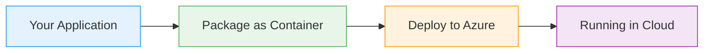

# Azure Files Storage

  <iconify-icon icon="vscode-icons:file-type-azure" style="font-size: 4rem;" />

---

---
layout: center
class: text-center
---

# Welcome

Welcome to this lab on Azure Files Storage

  <iconify-icon icon="carbon:rocket" style="font-size: 3rem; color: #0078d4;" />

---

---
layout: center
---

# What is Azure Files?

Azure Files is a fully managed file share service in the cloud. It provides shared storage that can be mounted into your filesystem, making it easy to...

---

---
layout: center
---

# Key Features

Let's look at the main features of Azure Files:

---

---
layout: center
---

# Common Use Cases

---

---
layout: center
---

# How it Works

Azure Files is a feature of Azure Storage Accounts. When you create a storage account, you can create one or more file shares within it. Each share has a quota that defines its maximum capacity.

---

---
layout: center
---

# Lab Overview

In today's lab, we'll walk through the complete Azure Files experience. We'll start by creating a storage account and file share. Then we'll upload files and explore different ways to access them.

