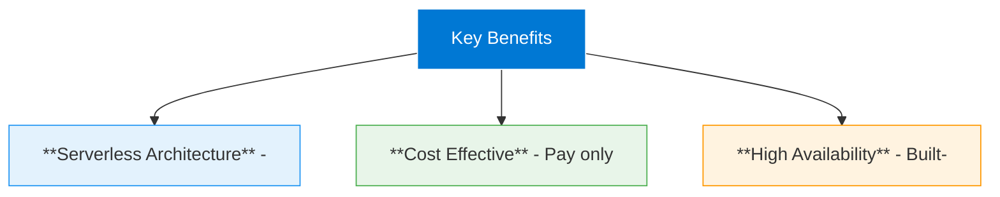

# Key Benefits

<iconify-icon icon="mdi:check-circle" class="text-green-500" /> **Serverless Architecture** - No web server to manage, update, or scale
<iconify-icon icon="mdi:check-circle" class="text-green-500" /> **Cost Effective** - Pay only for the storage you use
<iconify-icon icon="mdi:check-circle" class="text-green-500" /> **High Availability** - Built-in redundancy options keep your site accessible
<iconify-icon icon="mdi:check-circle" class="text-green-500" /> **Scalability** - Handle traffic spikes automatically
<iconify-icon icon="mdi:check-circle" class="text-green-500" /> **Global Reach** - Combine with CDN for worldwide content delivery

