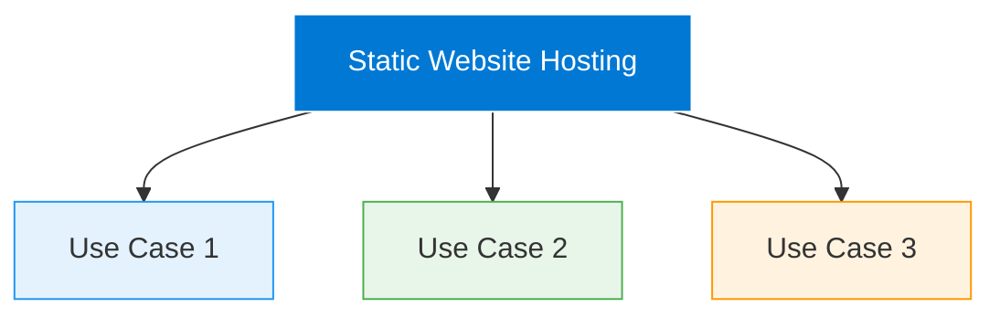

# Use Cases

```mermaid
graph TB
    Service[Static Website Hosting] --> UC1[Use Case 1]
    Service --> UC2[Use Case 2]
    Service --> UC3[Use Case 3]

    style Service fill:#0078d4,stroke:#fff,color:#fff
    style UC1 fill:#e3f2fd,stroke:#2196f3
    style UC2 fill:#e8f5e9,stroke:#4caf50
    style UC3 fill:#fff3e0,stroke:#ff9800
```

- Production workloads
- Development environments
- Testing scenarios

