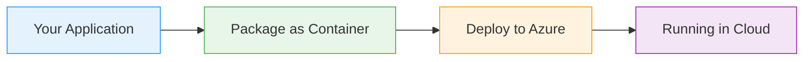
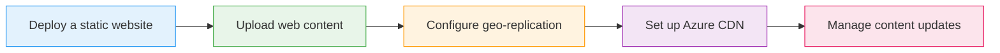

# Static Websites with Azure Storage Blobs

  <iconify-icon icon="vscode-icons:file-type-azure" style="font-size: 4rem;" />

---

---
layout: center
class: text-center
---

# Welcome

Welcome to this lab on hosting static websites with Azure Storage Blobs

  <iconify-icon icon="carbon:rocket" style="font-size: 3rem; color: #0078d4;" />

---

---
layout: center
---

# What are Static Websites on Azure Storage?

Azure Storage Blobs provide a cost-effective and scalable solution for hosting static web content. You can upload HTML files, JavaScript, CSS, images,...

---

---
layout: two-cols
---

# Key Benefits

<iconify-icon icon="mdi:check-circle" class="text-green-500" /> Serverless Architecture: - No web server to manage, update, or scale

<iconify-icon icon="mdi:check-circle" class="text-green-500" /> Cost Effective: - Pay only for the storage you use

<iconify-icon icon="mdi:check-circle" class="text-green-500" /> High Availability: - Built-in redundancy options keep your site accessible

<iconify-icon icon="mdi:check-circle" class="text-green-500" /> Scalability: - Handle traffic spikes automatically

<iconify-icon icon="mdi:check-circle" class="text-green-500" /> Global Reach: - Combine with CDN for worldwide content delivery

::right::

  <iconify-icon icon="carbon:chart-line-smooth" style="font-size: 8rem; color: #4caf50;" />

---

---
layout: center
---

# What We'll Cover

---

---
layout: center
---

# Use Cases

<iconify-icon icon="mdi:web" /> Marketing and promotional sites

<iconify-icon icon="mdi:cog" /> Documentation portals

<iconify-icon icon="mdi:code-braces" /> Single Page Applications (SPAs)

<iconify-icon icon="mdi:test-tube" /> Personal blogs and portfolios

<iconify-icon icon="mdi:lightning-bolt" /> Event landing pages

---

---
layout: center
---

# What You'll Need

To complete this lab, you'll need:

