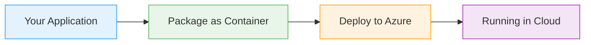

# Azure Table Storage

  <iconify-icon icon="vscode-icons:file-type-azure" style="font-size: 4rem;" />

---

---
layout: center
class: text-center
---

# Welcome

Welcome to this module on Azure Table Storage

  <iconify-icon icon="carbon:rocket" style="font-size: 3rem; color: #0078d4;" />

---

---
layout: center
---

# What is Azure Table Storage?

Azure Table Storage is a simple, scalable NoSQL database service that you can host in an Azure Storage Account. Unlike traditional relational database...

---

---
layout: center
---

# Key Concepts

<h3 class="text-xl font-bold">entities</h3>

. Think of entities as your data items, similar to rows in a SQL database or documents in MongoDB.

<h3 class="text-xl font-bold">partition key</h3>

. This is part of the entity's unique identifier. It's a grouping mechanism that Azure uses to deter

<h3 class="text-xl font-bold">row key</h3>

. This is the unique part of the entity's identifier. Together, the partition key and row key form a

---

---
layout: center
---

# Flexibility and Schema Design

One of Table Storage's interesting characteristics is its schema flexibility. Unlike SQL databases with rigid schemas, Table Storage entities can have different properties. You can have:

---

---
layout: center
---

# When to Use Table Storage

<iconify-icon icon="mdi:web" /> Simple, fast access to large amounts of structured data

<iconify-icon icon="mdi:cog" /> A cost-effective storage solution for semi-structured data

<iconify-icon icon="mdi:code-braces" /> High availability and durability without complex setup

<iconify-icon icon="mdi:test-tube" /> Integration with existing Azure services and workflows

---

---
layout: center
---

# Module Overview

In this module, we'll work through practical examples of:

