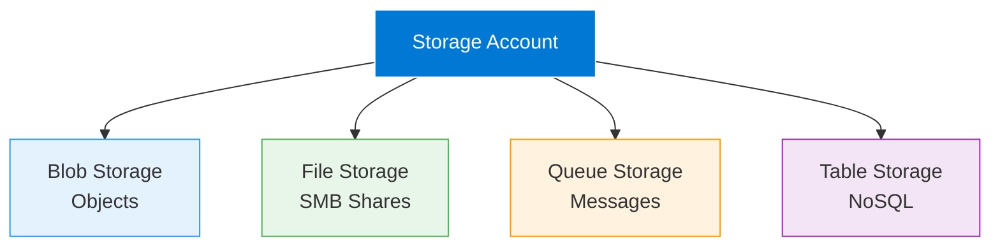

# Storage Services

```mermaid
graph TB
    SA[Storage Account] --> Blob[Blob Storage<br/>Objects]
    SA --> Files[File Storage<br/>SMB Shares]
    SA --> Queue[Queue Storage<br/>Messages]
    SA --> Table[Table Storage<br/>NoSQL]

    style SA fill:#0078d4,stroke:#fff,color:#fff
    style Blob fill:#e3f2fd,stroke:#2196f3
    style Files fill:#e8f5e9,stroke:#4caf50
    style Queue fill:#fff3e0,stroke:#ff9800
    style Table fill:#f3e5f5,stroke:#9c27b0
```

  
Multiple storage types in one account

