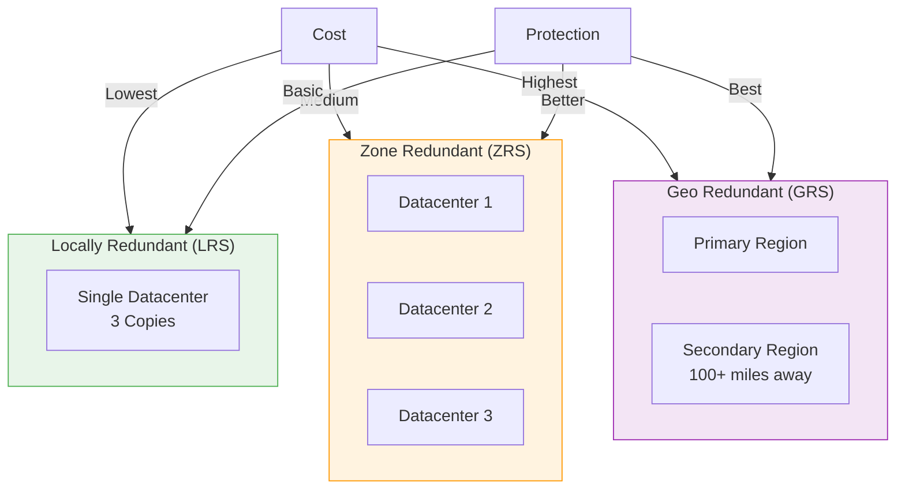

# Redundancy Options

```mermaid
graph TB
    subgraph LRS["Locally Redundant (LRS)"]
        DC1[Single Datacenter<br/>3 Copies]
    end

    subgraph ZRS["Zone Redundant (ZRS)"]
        DC2[Datacenter 1]
        DC3[Datacenter 2]
        DC4[Datacenter 3]
    end

    subgraph GRS["Geo Redundant (GRS)"]
        R1[Primary Region]
        R2[Secondary Region<br/>100+ miles away]
    end

    Cost[Cost] -->|Lowest| LRS
    Cost -->|Medium| ZRS
    Cost -->|Highest| GRS

    Protection[Protection] -->|Basic| LRS
    Protection -->|Better| ZRS
    Protection -->|Best| GRS

    style LRS fill:#e8f5e9,stroke:#4caf50
    style ZRS fill:#fff3e0,stroke:#ff9800
    style GRS fill:#f3e5f5,stroke:#9c27b0
```
