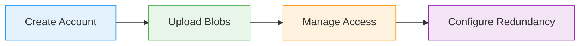

# What You'll Learn

```mermaid
graph LR
    A[Create Account] --> B[Upload Blobs]
    B --> C[Manage Access]
    C --> D[Configure Redundancy]

    style A fill:#e3f2fd,stroke:#2196f3
    style B fill:#e8f5e9,stroke:#4caf50
    style C fill:#fff3e0,stroke:#ff9800
    style D fill:#f3e5f5,stroke:#9c27b0
```

- Storage account creation
- Blob containers
- Public vs private access
- VM disk storage
- Azure CLI operations

