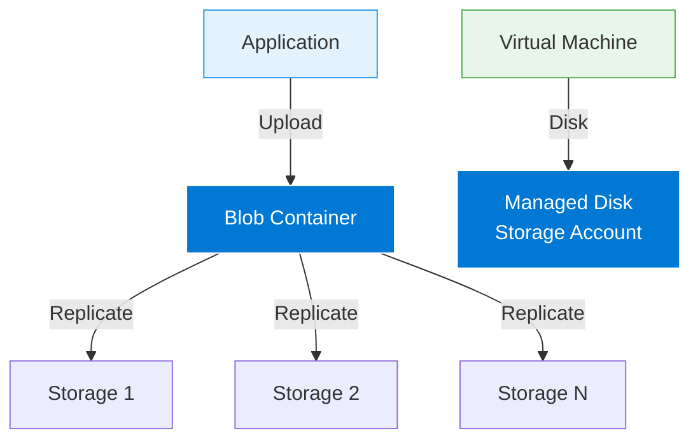

# Storage Architecture

```mermaid
graph TB
    App[Application] -->|Upload| Container[Blob Container]
    Container -->|Replicate| Store1[Storage 1]
    Container -->|Replicate| Store2[Storage 2]
    Container -->|Replicate| Store3[Storage N]

    VM[Virtual Machine] -->|Disk| Disk[Managed Disk<br/>Storage Account]

    style App fill:#e3f2fd,stroke:#2196f3
    style Container fill:#0078d4,stroke:#fff,color:#fff
    style VM fill:#e8f5e9,stroke:#4caf50
    style Disk fill:#0078d4,stroke:#fff,color:#fff
```

Secure, durable, and highly available

