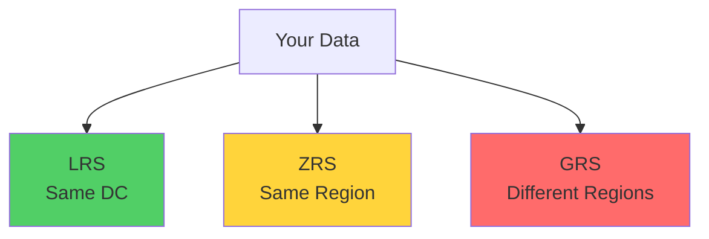
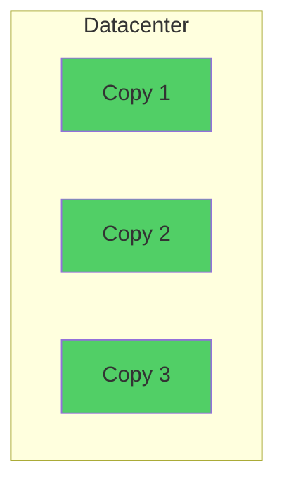
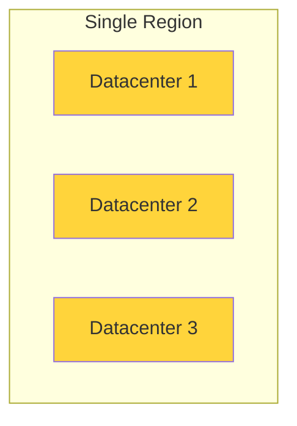
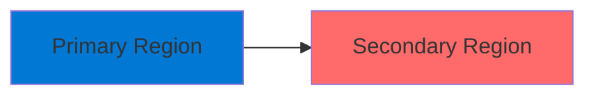
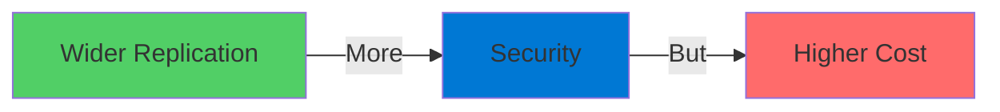

# Azure Storage Accounts

Highly Available, Secure, Scalable Storage

  <carbon-data-storage class="text-8xl text-blue-400 opacity-80" />

---
layout: center
---

# Welcome

<!--
METADATA:
sentence: What are Storage Accounts?
search_anchor: What are Storage Accounts
-->
<v-click>

Explore Azure Storage Accounts Fundamental building blocks of Azure

</v-click>

---
layout: section
---

# What are Storage Accounts?

---

# Managed Storage Service

<v-click>

  <carbon-data-storage class="text-6xl text-blue-400" />

</v-click>

<!--
METADATA:
sentence: Azure Storage Accounts are a managed storage service that allows you to store data in the cloud.
search_anchor: Azure Storage Accounts are a
-->
<v-click>

Store data in the cloud

</v-click>

<!--
METADATA:
sentence: You have complete control over who can access your data - you can make it publicly accessible, restrict it to specific users, or limit access to other Azure services.
search_anchor: You have complete control over
-->
<v-click>

Complete control over access:

</v-click>

<!--
METADATA:
sentence: You have complete control over who can access your data - you can make it publicly accessible, restrict it to specific users, or limit access to other Azure services.
search_anchor: You have complete control over
-->
<v-click>

  <carbon-globe class="text-3xl text-green-400" />
  Publicly accessible

</v-click>

<!--
METADATA:
sentence: Azure Storage Accounts - Introduction Opening Welcome to this lab on Azure Storage Accounts.
search_anchor: Azure Storage Accounts - Introduction
-->
<v-click>

  <carbon-locked class="text-3xl text-red-400" />
  Restricted to specific users

</v-click>

<!--
METADATA:
sentence: Azure Storage Accounts - Introduction Opening Welcome to this lab on Azure Storage Accounts.
search_anchor: Azure Storage Accounts - Introduction
-->
<v-click>

  <carbon-logo-microsoft-azure class="text-3xl text-blue-400" />
  Limited to Azure services

</v-click>

---

# Key Benefits

<!--
METADATA:
sentence: Your data is automatically replicated across multiple locations to ensure high availability and durability.
search_anchor: Your data is automatically replicated
-->
<v-click>

  <carbon-copy class="text-5xl text-green-400 mt-1" />
  

    
Built-in Redundancy

    
Data replicated across multiple locations

    
High availability and durability

  

</v-click>

<!--
METADATA:
sentence: And you're not locked into a single configuration - you can choose different performance levels based on your specific needs and budget.
search_anchor: you're not locked into a
-->
<v-click>

  <carbon-settings-adjust class="text-5xl text-purple-400 mt-1" />
  

    
Flexible Configuration

    
Different performance levels

    
Based on needs and budget

  

</v-click>

---
layout: section
---

# What We'll Cover

---

# Lab Objectives

<!--
METADATA:
sentence: What are Storage Accounts?
search_anchor: What are Storage Accounts
-->
<v-click>

  <carbon-add class="text-4xl text-blue-400" />
  Creating storage accounts using Azure CLI

</v-click>

<!--
METADATA:
sentence: One of the key benefits of Storage Accounts is built-in redundancy.
search_anchor: One of the key benefits
-->
<v-click>

  <carbon-copy class="text-4xl text-green-400" />
  Understanding performance and redundancy levels

</v-click>

<!--
METADATA:
sentence: Getting Started Let's get started with our hands-on exercises.
search_anchor: Getting Started Let's get started
-->
<v-click>

  <carbon-data-blob class="text-4xl text-purple-400" />
  Working with blob containers

</v-click>

<!--
METADATA:
sentence: This is the most cost-effective option and protects against hardware failures.
search_anchor: This is the most cost-effective
-->
<v-click>

  <carbon-locked class="text-4xl text-red-400" />
  Managing public and private access

</v-click>

<!--
METADATA:
sentence: What are Storage Accounts?
search_anchor: What are Storage Accounts
-->
<v-click>

  <carbon-data-1 class="text-4xl text-orange-400" />
  Storing VM disks in storage accounts

</v-click>

---
layout: section
---

# Redundancy Options

---

# Data Replication Levels

<!--
METADATA:
sentence: Azure offers several levels of replication: Locally Redundant Storage - or LRS - replicates your data within a single datacenter.
search_anchor: Azure offers several levels of
-->
<v-click>

Azure offers several levels of replication

</v-click>

<v-click>

</v-click>

---

# LRS: Locally Redundant Storage

<v-click>

  <carbon-data-center class="text-6xl text-green-400" />

</v-click>

<!--
METADATA:
sentence: Azure offers several levels of replication: Locally Redundant Storage - or LRS - replicates your data within a single datacenter.
search_anchor: Azure offers several levels of
-->
<v-click>

Replicates within a single datacenter

</v-click>

<v-click>

</v-click>

<!--
METADATA:
sentence: This is the most cost-effective option and protects against hardware failures.
search_anchor: This is the most cost-effective
-->
<v-click>

  

    <carbon-currency-dollar class="text-5xl text-green-400" />
    
Most Cost-Effective

  

  

    <carbon-checkmark class="text-5xl text-blue-400" />
    
Hardware Protection

  

</v-click>

---

# ZRS: Zone Redundant Storage

<v-click>

  <carbon-location class="text-6xl text-yellow-400" />

</v-click>

<!--
METADATA:
sentence: Zone Redundant Storage - or ZRS - replicates your data across multiple datacenters within a single region.
search_anchor: Zone Redundant Storage - or
-->
<v-click>

Replicates across multiple datacenters

</v-click>

<v-click>

</v-click>

<!--
METADATA:
sentence: This provides better availability than LRS.
search_anchor: This provides better availability than
-->
<v-click>

Better availability than LRS

</v-click>

---

# GRS: Geo-Redundant Storage

<v-click>

  <carbon-location-company class="text-6xl text-red-400" />

</v-click>

<!--
METADATA:
sentence: Geo-Redundant Storage - or GRS - replicates your data across different regions entirely.
search_anchor: Geo-Redundant Storage - or GRS
-->
<v-click>

Replicates across different regions

</v-click>

<v-click>

</v-click>

<!--
METADATA:
sentence: This gives you the highest level of protection, but comes at a higher cost.
search_anchor: This gives you the highest
-->
<v-click>

  

    <carbon-shield class="text-5xl text-green-400" />
    
Highest Protection

  

  

    <carbon-currency-dollar class="text-5xl text-red-400" />
    
Higher Cost

  

</v-click>

---

# The Key Takeaway

<v-click>

</v-click>

<!--
METADATA:
sentence: Your data becomes more secure with wider replication, but you'll pay more for that additional protection.
search_anchor: Your data becomes more secure
-->
<v-click>

More secure with wider replication

</v-click>

<!--
METADATA:
sentence: Your data becomes more secure with wider replication, but you'll pay more for that additional protection.
search_anchor: Your data becomes more secure
-->
<v-click>

But you pay more for additional protection

</v-click>

---

# Redundancy Comparison

<!--
METADATA:
sentence: This is the most cost-effective option and protects against hardware failures.
search_anchor: This is the most cost-effective
-->
<v-click>

| Level | Protection | Cost |
|-------|-----------|------|
| LRS | Hardware failures | $ |
| ZRS | DC failures | $$ |
| GRS | Regional disasters | $$$ |

</v-click>

<!--
METADATA:
sentence: And you're not locked into a single configuration - you can choose different performance levels based on your specific needs and budget.
search_anchor: you're not locked into a
-->
<v-click>

Choose based on your requirements and budget

</v-click>

---
layout: section
---

# Getting Started

---

# Lab Flow

<!--
METADATA:
sentence: What We'll Cover In this lab, we'll explore the basics of Azure Storage Accounts.
search_anchor: What We'll Cover In this
-->
<v-click>

  
1

  

    <carbon-search class="text-3xl inline-block" />
    Explore options in Azure Portal
  

</v-click>

<!--
METADATA:
sentence: What are Storage Accounts?
search_anchor: What are Storage Accounts
-->
<v-click>

  
2

  

    <carbon-command-line class="text-3xl inline-block" />
    Create storage account using Azure CLI
  

</v-click>

<!--
METADATA:
sentence: You'll learn how to create storage accounts, understand different redundancy options, and work with blob storage to upload both small and large files.
search_anchor: You'll learn how to create
-->
<v-click>

  
3

  

    <carbon-data-blob class="text-3xl inline-block" />
    Work with blob containers and files
  

</v-click>

<!--
METADATA:
sentence: This is the most cost-effective option and protects against hardware failures.
search_anchor: This is the most cost-effective
-->
<v-click>

  
4

  

    <carbon-test-tool class="text-3xl inline-block" />
    Test public and private access
  

</v-click>

---
layout: center
class: text-center
---

<v-click>

<carbon-play-outline class="text-8xl text-green-400 inline-block" />

</v-click>

<!--
METADATA:
sentence: Getting Started Let's get started with our hands-on exercises.
search_anchor: Getting Started Let's get started
-->
<v-click>

Let's Get Started!

</v-click>

<!--
METADATA:
sentence: What are Storage Accounts?
search_anchor: What are Storage Accounts
-->
<v-click>

Hands-on with Azure Storage Accounts

</v-click>

