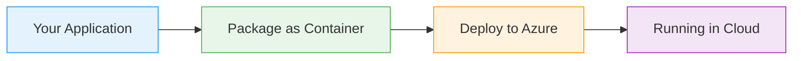
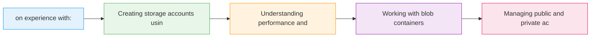

# Azure Storage Accounts

  <iconify-icon icon="vscode-icons:file-type-azure" style="font-size: 4rem;" />

---

---
layout: center
class: text-center
---

# Welcome

Welcome to this lab on Azure Storage Accounts

  <iconify-icon icon="carbon:rocket" style="font-size: 3rem; color: #0078d4;" />

---

---
layout: center
---

# What are Storage Accounts?

Azure Storage Accounts are a managed storage service that allows you to store data in the cloud. You have complete control over who can access your da...

---

---
layout: center
---

# What We'll Cover

---

---
layout: center
---

# Redundancy Options

Before we dive into the exercises, let's talk about data redundancy. Azure offers several levels of replication:

---

---
layout: center
class: text-center
---

# Getting Started

<iconify-icon icon="mdi:checkbox-marked-circle" class="text-blue-500" /> on exercises. We'll begin by exploring the options available when creating a Storage Account, then move on to creating one ourselves using the Azure CLI.

  <iconify-icon icon="carbon:rocket" style="font-size: 3rem; color: #0078d4;" />

