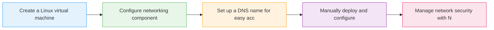

# Virtual Machines - Web Server: Introduction

  <iconify-icon icon="bi:pc-display" style="font-size: 4rem;" />

---

---
layout: center
---

# Overview

Virtual Machines are one of the simplest ways to get a workload running in the cloud. They're particularly useful for applications that need to be available 24/7, like web servers. But running a web s

---

---
layout: center
---

# What You'll Learn

---

---
layout: center
---

# Key Concepts

---

---
layout: center
---

# The Scenario

We'll be creating a Linux VM running Ubuntu Server, then manually installing and configuring the Nginx web server. This hands-on approach will give you a clear understanding of what's happening behind

