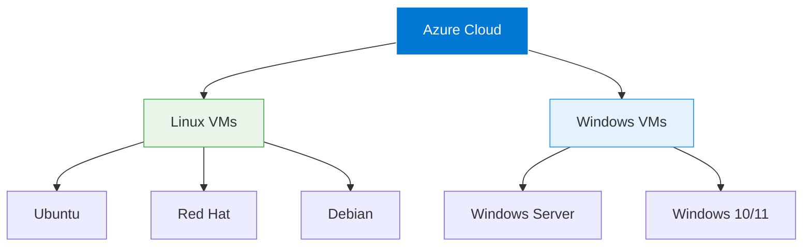

# What are Azure VMs?

```mermaid
graph TB
    Azure[Azure Cloud] --> Linux[Linux VMs]
    Azure --> Windows[Windows VMs]

    Linux --> Ubuntu[Ubuntu]
    Linux --> RedHat[Red Hat]
    Linux --> Debian[Debian]

    Windows --> Server[Windows Server]
    Windows --> Desktop[Windows 10/11]

    style Azure fill:#0078d4,stroke:#fff,color:#fff
    style Linux fill:#e8f5e9,stroke:#4caf50
    style Windows fill:#e3f2fd,stroke:#2196f3
```

  
Full OS control in the cloud

