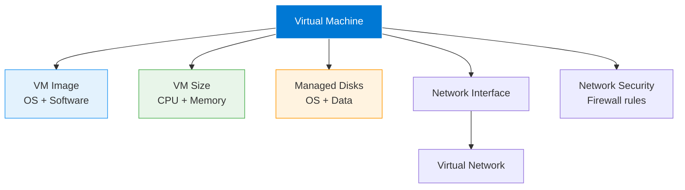

# VM Architecture

```mermaid
graph TB
    VM[Virtual Machine]

    VM --> Image[VM Image<br/>OS + Software]
    VM --> Size[VM Size<br/>CPU + Memory]
    VM --> Disk[Managed Disks<br/>OS + Data]
    VM --> NIC[Network Interface]
    VM --> NSG[Network Security<br/>Firewall rules]

    NIC --> VNet[Virtual Network]

    style VM fill:#0078d4,stroke:#fff,color:#fff
    style Image fill:#e3f2fd,stroke:#2196f3
    style Size fill:#e8f5e9,stroke:#4caf50
    style Disk fill:#fff3e0,stroke:#ff9800
```
