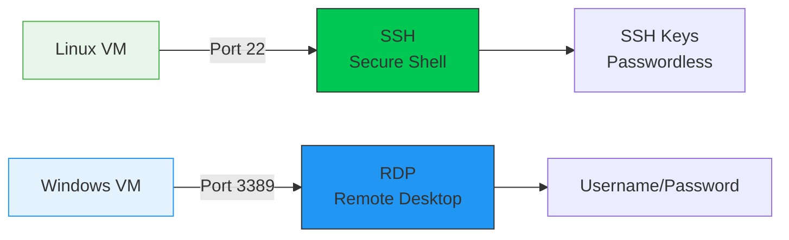

# Connection Methods

```mermaid
graph LR
    Linux[Linux VM] -->|Port 22| SSH[SSH<br/>Secure Shell]
    Windows[Windows VM] -->|Port 3389| RDP[RDP<br/>Remote Desktop]

    SSH --> Keys[SSH Keys<br/>Passwordless]
    RDP --> Creds[Username/Password]

    style Linux fill:#e8f5e9,stroke:#4caf50
    style Windows fill:#e3f2fd,stroke:#2196f3
    style SSH fill:#00c853,stroke:#333
    style RDP fill:#2196f3,stroke:#333
```

- SSH for Linux
- RDP for Windows
- Network security groups

