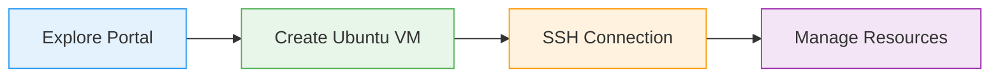

# What You'll Learn

```mermaid
graph LR
    A[Explore Portal] --> B[Create Ubuntu VM]
    B --> C[SSH Connection]
    C --> D[Manage Resources]

    style A fill:#e3f2fd,stroke:#2196f3
    style B fill:#e8f5e9,stroke:#4caf50
    style C fill:#fff3e0,stroke:#ff9800
    style D fill:#f3e5f5,stroke:#9c27b0
```

- VM images & sizes
- Network configuration
- Disk management
- Azure CLI operations

