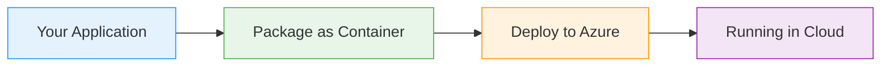
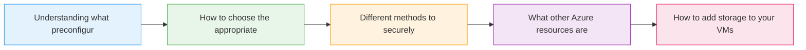

# Virtual Machines

  <iconify-icon icon="bi:pc-display" style="font-size: 4rem;" />

---

---
layout: center
---

# Virtual Machines - Introduction

Welcome to this lab on Azure Virtual Machines. In this session, we'll explore how Azure VMs provide cloud-based compute resources that function just like VMs in your datacenter or on your desktop.

---

---
layout: center
---

# What Are Azure Virtual Machines?

Virtual Machines in Azure are isolated compute environments running a full operating system. You have complete administrative permissions to install a...

---

---
layout: center
---

# Key Concepts We'll Cover

---

---
layout: center
---

# What You'll Do

First, we'll explore Virtual Machines through the Azure Portal to understand all the configuration options available.

