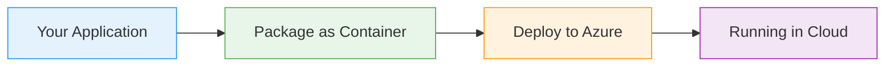

# Virtual Machine Scale Sets - Linux: Introduction

  <iconify-icon icon="bi:pc-display" style="font-size: 4rem;" />

---

---
layout: center
class: text-center
---

# Welcome

Welcome to this lab on Virtual Machine Scale Sets with Linux

  <iconify-icon icon="carbon:rocket" style="font-size: 3rem; color: #0078d4;" />

---

---
layout: center
---

# Context and Motivation

When working with VM Scale Sets, you have two main approaches for getting your application running on instances. The first approach is to use a custom image that contains your application pre-installe

---

---
layout: center
---

# What is cloud-init?

cloud-init is a powerful cross-platform system for configuring new machines. It allows you to automate all the usual steps for deploying pre-requisite...

---

---
layout: center
---

# Lab Objectives

In this lab, you'll learn how to:

---

---
layout: center
---

# What You'll Build

We'll start by creating a single VM with a cloud-init script to understand how the system works. Then we'll move to a full VM Scale Set running Nginx web servers, where each instance is automatically 

---

---
layout: center
class: text-center
---

# Prerequisites

<iconify-icon icon="mdi:checkbox-marked-circle" class="text-blue-500" /> An active Azure subscription

<iconify-icon icon="mdi:checkbox-marked-circle" class="text-blue-500" /> Azure CLI installed and configured

<iconify-icon icon="mdi:checkbox-marked-circle" class="text-blue-500" /> Basic familiarity with Linux and shell commands

<iconify-icon icon="mdi:checkbox-marked-circle" class="text-blue-500" /> Understanding of VM Scale Sets from previous labs

<iconify-icon icon="mdi:checkbox-marked-circle" class="text-blue-500" /> init works with a single VM.

  <iconify-icon icon="carbon:rocket" style="font-size: 3rem; color: #0078d4;" />

