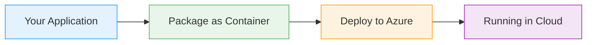

# Virtual Machine Scale Sets - Windows

  <iconify-icon icon="bi:pc-display" style="font-size: 4rem;" />

---

---
layout: center
class: text-center
---

# Welcome

Welcome to this lab on Virtual Machine Scale Sets for Windows

  <iconify-icon icon="carbon:rocket" style="font-size: 3rem; color: #0078d4;" />

---

---
layout: center
---

# What Are Virtual Machine Scale Sets?

When you need to run multiple instances of your application, you could create individual VMs - each with their own IP addresses and public IPs. But th...

---

---
layout: center
---

# Lab Overview

In this lab, we'll be working with a Windows application that's already been captured as a custom VM image. We'll use this image to create a VMSS and explore the key features.

---

---
layout: center
class: text-center
---

# Prerequisites

<iconify-icon icon="mdi:checkbox-marked-circle" class="text-blue-500" /> image" that contains a Windows application with IIS configured.

<iconify-icon icon="mdi:checkbox-marked-circle" class="text-blue-500" /> vmss-win" with that image already in place.

  <iconify-icon icon="carbon:rocket" style="font-size: 3rem; color: #0078d4;" />

---

---
layout: center
---

# Portal Exploration

Let's start by looking at VMSS in the Azure Portal. When you search for Virtual Machine Scale Sets and begin creating one, you'll notice several important configuration options.

---

---
layout: center
---

# What's Next

Now that we understand what VMSS provides, let's move on to actually creating one from our custom image and getting our application running across multiple instances.

