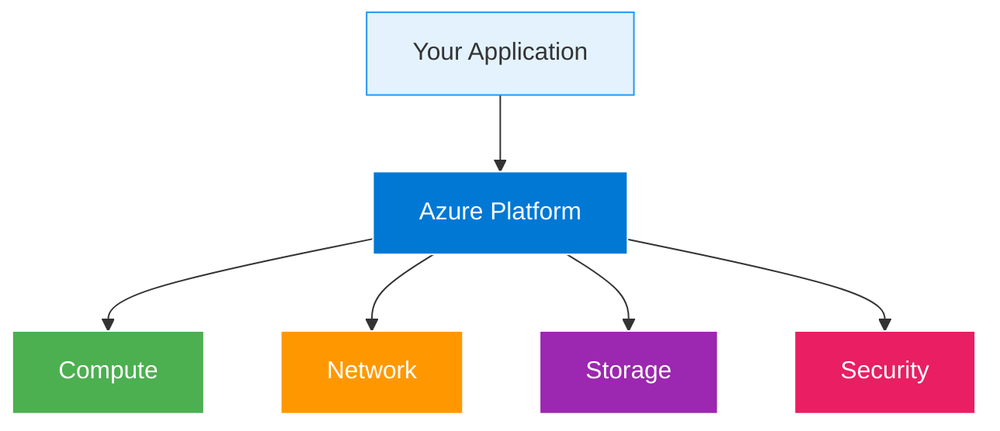

# Securing Apps with Key Vault and Virtual Networks

  <iconify-icon icon="carbon:network-4" style="font-size: 4rem;" />

---

---
layout: center
---

# Securing Apps with Key Vault and Virtual Networks - Introduction

Welcome to this lab on securing Azure applications using Key Vault and Virtual Networks. In this session, we'll explore how to build truly secure applications in Azure by combining two powerful securi

---

---
layout: center
---

# The Security Challenge

When building applications in Azure, we face two major security challenges. First, how do we manage credentials securely? Connection strings, API keys, and other secrets need to be stored somewhere, a

---

---
layout: center
---

# The Ideal Azure Application

The ideal application in Azure uses managed identities for all authentication and restricted virtual networks for all communication. This approach means there are no credentials to manage and store, a

---

---
layout: center
---

# What We'll Build

In this lab, we'll deploy a web application that uses Blob Storage for data persistence. The connection details for the storage account will be stored in Azure Key Vault, which we'll restrict to only 

---

---
layout: center
---

# Key Concepts

<h3 class="text-xl font-bold">Managed Identity</h3>

An automatically managed identity in Azure Active Directory that your application can use to authent

<h3 class="text-xl font-bold">Virtual Networks</h3>

Isolated networks in Azure that allow you to control network traffic between resources. You can rest

<h3 class="text-xl font-bold">Service Endpoints</h3>

Enable private connectivity from your VNet to Azure services over the Azure backbone network, withou

<h3 class="text-xl font-bold">VNet Integration</h3>

Allows App Service apps to make outbound calls into your Virtual Network, enabling them to access re

---

---
layout: two-cols
---

# The Architecture

::right::

<h3>Azure Manages</h3>
<ul>

</ul>

<h3>You Control</h3>
<ul>

</ul>

