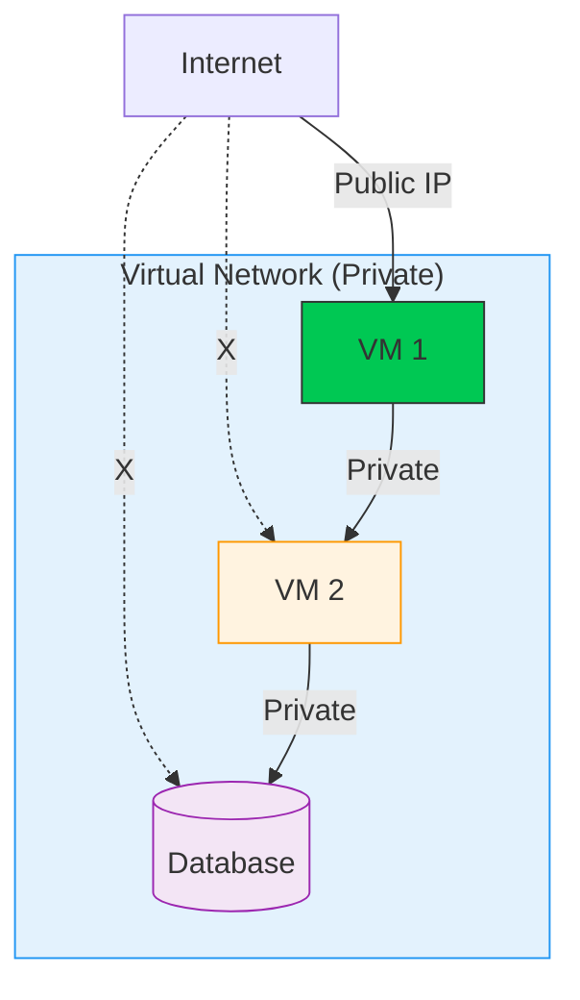

# What are VNets?

```mermaid
graph TB
    Internet[Internet]

    subgraph VNet["Virtual Network (Private)"]
        VM1[VM 1]
        VM2[VM 2]
        DB[(Database)]
    end

    Internet -.X.-> VM2
    Internet -.X.-> DB
    Internet -->|Public IP| VM1

    VM1 -->|Private| VM2
    VM2 -->|Private| DB

    style VNet fill:#e3f2fd,stroke:#2196f3
    style VM1 fill:#00c853,stroke:#333
    style VM2 fill:#fff3e0,stroke:#ff9800
    style DB fill:#f3e5f5,stroke:#9c27b0
```

  
Your private datacenter network in Azure

