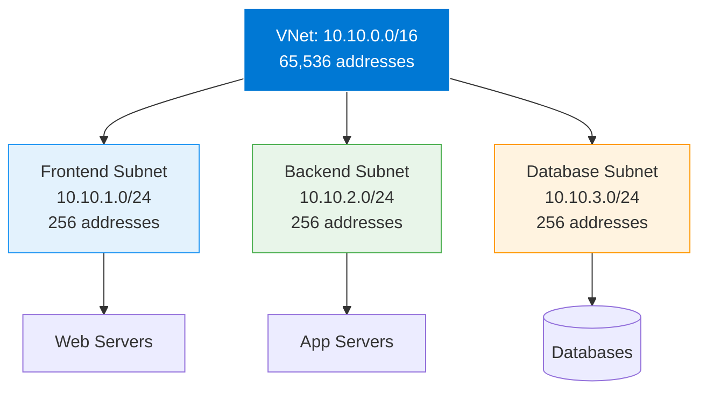

# VNet Structure

```mermaid
graph TB
    VNet["VNet: 10.10.0.0/16<br/>65,536 addresses"]

    VNet --> Sub1["Frontend Subnet<br/>10.10.1.0/24<br/>256 addresses"]
    VNet --> Sub2["Backend Subnet<br/>10.10.2.0/24<br/>256 addresses"]
    VNet --> Sub3["Database Subnet<br/>10.10.3.0/24<br/>256 addresses"]

    Sub1 --> Web[Web Servers]
    Sub2 --> App[App Servers]
    Sub3 --> DB[(Databases)]

    style VNet fill:#0078d4,stroke:#fff,color:#fff
    style Sub1 fill:#e3f2fd,stroke:#2196f3
    style Sub2 fill:#e8f5e9,stroke:#4caf50
    style Sub3 fill:#fff3e0,stroke:#ff9800
```
