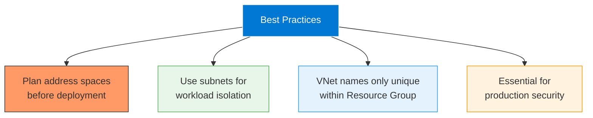

# VNet Best Practices

```mermaid
graph TB
    BP[Best Practices] --> P1[Plan address spaces<br/>before deployment]
    BP --> P2[Use subnets for<br/>workload isolation]
    BP --> P3[VNet names only unique<br/>within Resource Group]
    BP --> P4[Essential for<br/>production security]

    style BP fill:#0078d4,stroke:#fff,color:#fff
    style P1 fill:#f96,stroke:#333
    style P2 fill:#e8f5e9,stroke:#4caf50
    style P3 fill:#e3f2fd,stroke:#2196f3
    style P4 fill:#fff3e0,stroke:#ff9800
```
