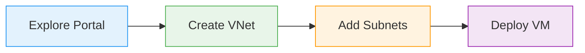

# What You'll Learn

```mermaid
graph LR
    A[Explore Portal] --> B[Create VNet]
    B --> C[Add Subnets]
    C --> D[Deploy VM]

    style A fill:#e3f2fd,stroke:#2196f3
    style B fill:#e8f5e9,stroke:#4caf50
    style C fill:#fff3e0,stroke:#ff9800
    style D fill:#f3e5f5,stroke:#9c27b0
```

- VNet and subnet creation
- Address space planning
- Azure CLI operations
- ARM templates

