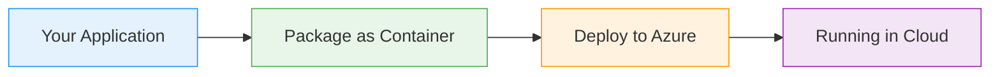
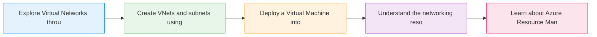

# Virtual Networks

  <iconify-icon icon="carbon:network-4" style="font-size: 4rem;" />

---

---
layout: center
class: text-center
---

# Welcome

Welcome to this lab on Azure Virtual Networks

  <iconify-icon icon="carbon:rocket" style="font-size: 3rem; color: #0078d4;" />

---

---
layout: center
---

# What are Virtual Networks?

Virtual Networks, or VNets as they're commonly called, are private networks in Azure. They allow your services to communicate with each other securely...

---

---
layout: center
---

# Why Virtual Networks Matter

Virtual Networks are a core component in deploying secure solutions in Azure. If you're building production applications, you should aim to use VNets for all your services, provided those services sup

---

---
layout: center
---

# Key Concepts

---

---
layout: center
---

# Naming Requirements

Here's a nice detail: unlike many Azure resources, VNet names don't need to be globally unique. They just need to be unique within the Resource Group. This gives you more flexibility in your naming co

---

---
layout: center
---

# What You'll Learn

